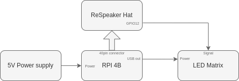

# Speaker Diarization on LED Matrix

# Description

This project implements the Generalized End-to-End Loss for Speaker Verification to display speaker names on an LED matrix. The system utilizes a Raspberry Pi 4 Model B with the [ReSpeaker 6-Mic Circular Array Kit](https://wiki.seeedstudio.com/ReSpeaker_6-Mic_Circular_Array_kit_for_Raspberry_Pi/). The [official library](https://github.com/respeaker/seeed-voicecard/tree/master) allows the microphones to function as standard audio inputs. The module is used solely to record raw signals without any additional processing. An assembled WS2812B programmable LED matrix displays the speaker's initials.

# Hardware

The block diagram below illustrates the setup.

The microcomputer connects to the LED matrix via one of the 40 available GPIO pins. However, the ReSpeaker HAT occupies all these pins, so an additional connector on the Seeed voicecard module is used.

# Speaker Verification

## Embedding Calculation

The Generalized End-to-End Loss uses a 3-layer LSTM network. The first layer processes the MFCC vector of a recorded utterance. A pre-trained model calculates 256 elementary embeddings representing the speaker's voice timbre. The next step involves comparing the saved embeddings with real-time recorded vectors. More detailed information can be found in the [reference article](https://arxiv.org/pdf/1710.10467).

## Comparison of Speakers

The key aspect is comparing the embeddings of speakers with each other. When the embeddings are similar to any of the saved speakers, it identifies the person. I use cosine similarity for this comparison. However, there is one issue: there can be situations where no one is speaking or a completely different person is speaking.

## Comparison Threshold

Classifying when no one is speaking is straightforward using a Voice Activity Detector. To detect an unrecognized voice timbre, a threshold is applied. If the similarity to all saved speakers is below this threshold, the system identifies it as a different speaker.

# Program Operation

Before running the program, you must record some utterances to calculate embeddings. This process creates a group of voice timbres. All embeddings are saved in the specific folder, which contains a dictionary for the specific group of voices.

Next, run the program. The microphone signal is streamed in real time, and for each buffer, the following steps are performed:

- Calculate MFCC (Mel-Frequency Cepstral Coefficients)
- Apply GE2E (Generalized End-to-End) 
- Compare the current buffer's embedding to all saved embeddings
- Verify the speaker
- Display the information of the identified speaker

## Contributing

I welcome contributions! Please fork the repository, make your changes, and submit a pull request. Thank you for helping improve this project!

# Sources
### Articles:
- [GE2E](https://arxiv.org/pdf/1710.10467) 
- [TD-SV](https://arxiv.org/pdf/1509.08062)
- [YouTube Video](https://www.youtube.com/watch?v=AkCPHw2m6bY)
### Repos and Libraries:
- [Seeed-voicecard Driver](https://github.com/respeaker/seeed-voicecard)
- [GE2E Implementation](https://github.com/CorentinJ/Real-Time-Voice-Cloning)
- [LED Matrix Driver](https://github.com/rm-hull/luma.core)

